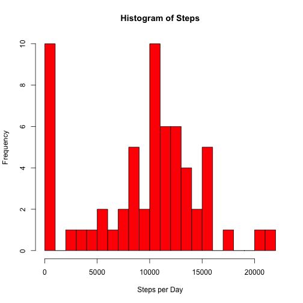
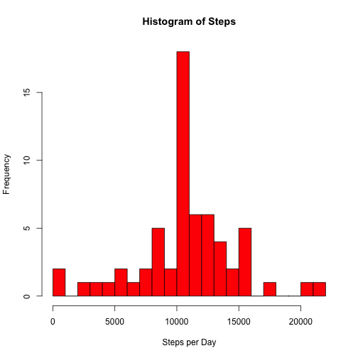

## Loading and preprocessing the data

Set the working directory where the CSV file is located.


```r
setwd("U:/R Directory/RepRes PA1")
```

```
## Error in setwd("U:/R Directory/RepRes PA1"): cannot change working directory
```

Load the data


```r
library("foreign")
data<-read.csv("activity.csv", header=T)
attach(data)
summary(data)
```

```
##      steps                date          interval     
##  Min.   :  0.00   2012-10-01:  288   Min.   :   0.0  
##  1st Qu.:  0.00   2012-10-02:  288   1st Qu.: 588.8  
##  Median :  0.00   2012-10-03:  288   Median :1177.5  
##  Mean   : 37.38   2012-10-04:  288   Mean   :1177.5  
##  3rd Qu.: 12.00   2012-10-05:  288   3rd Qu.:1766.2  
##  Max.   :806.00   2012-10-06:  288   Max.   :2355.0  
##  NA's   :2304     (Other)   :15840
```

## What is mean total number of steps taken per day?

Plot a histogram of the steps data, ignoring NAs


```r
DailySteps<-tapply(data$steps,data$date,FUN=sum,na.rm=T)
hist(DailySteps, breaks=20, col="red",xlab="Steps per Day", main="Histogram of Steps")
```

 

Calculate the mean and median number of steps per day


```r
m1<-mean(DailySteps, na.rm=T)
med1<-median(DailySteps, na.rm=T)
```

The mean number of steps per day is 9354.2295082. 

The median number of steps per day is 10395.

## What is the average daily activity pattern?

Make a time series plot of the 5-minute intervals and the average number of steps taken, averaged across all days.


```r
avg <- aggregate(x=data$steps,by=list(data$interval),FUN=mean, na.rm=TRUE)
attach(avg)
plot(Group.1,x,type='l',xlab='5-minute interval',ylab='Avg. steps taken')
```

 

```r
maxint<-avg[which.max(avg$x),1]
```

The 5-minute interval, on average, with the most steps is 835.

## Imputing missing values


```r
NumberMissing<-sum(is.na(data$steps))
```

There are 2304 missing values in the dataset.

Replace missing values with the mean for that 5-minute interval across days. The result is a new dataset, in this case called NewData


```r
ImpVals<-rbind(avg,avg,avg,avg,avg,avg,avg,avg,avg,avg,avg,avg)
ImpVals2<-rbind(ImpVals,ImpVals,ImpVals,ImpVals,ImpVals,avg)
NewData<-cbind(data,ImpVals2$x)
attach(NewData)
```

```
## The following objects are masked from data:
## 
##     date, interval, steps
```

```r
NewData$steps <- ifelse(is.na(steps),ImpVals$x,steps)
```

Make a histogram of the total number of steps taken each day. 


```r
DailySteps2<-tapply(NewData$steps,NewData$date,FUN=sum)
hist(DailySteps2, breaks=20, col="red",xlab="Steps per Day", main="Histogram of Steps")
```

 

Calculate and report the mean and median total number of steps taken per day.


```r
m2<-mean(DailySteps2)
med2<-median(DailySteps2)
```

The mean number of steps per day is 1.0766189 &times; 10<sup>4</sup>. 

The median number of steps per day is 1.0766189 &times; 10<sup>4</sup>.

## Are there differences in activity patterns between weekdays and weekends?

Create a new factor indicating if the given date is a weekday or weekend.


```r
NewData$date<-as.Date(NewData$date)
wkday<-weekdays(NewData$date)
NewData<-cbind(NewData,wkday)
NewData$daycat[wkday=="Monday"]<-"Weekday"
NewData$daycat[wkday=="Tuesday"]<-"Weekday"
NewData$daycat[wkday=="Wednesday"]<-"Weekday"
NewData$daycat[wkday=="Thursday"]<-"Weekday"
NewData$daycat[wkday=="Friday"]<-"Weekday"
NewData$daycat[wkday=="Saturday"]<-"Weekend"
NewData$daycat[wkday=="Sunday"]<-"Weekend"
```

Make a panel plot containing a time series plot (i.e. type = "l") of the 5-minute interval (x-axis) and the average number of steps taken, averaged across all weekday days or weekend days.

Time series plot of the average steps taken on weekdays:


```r
steps.weekday <- aggregate(steps ~ interval, data = NewData, subset = NewData$daycat=="Weekday", FUN = mean)
plot(steps.weekday, type = "l")
```

 

Time series plot of the average steps taken on weekends:


```r
steps.weekend <- aggregate(steps ~ interval, data = NewData, subset = NewData$daycat=="Weekend", FUN = mean)
plot(steps.weekend, type = "l")
```

 
